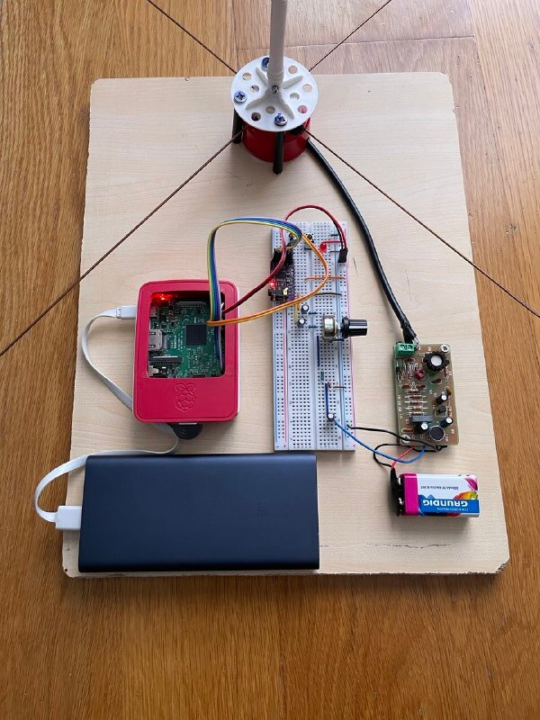
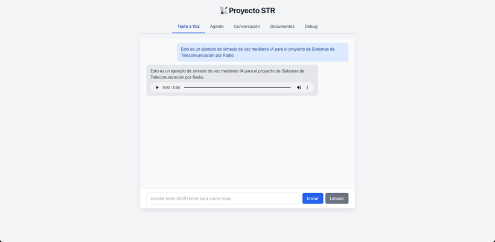
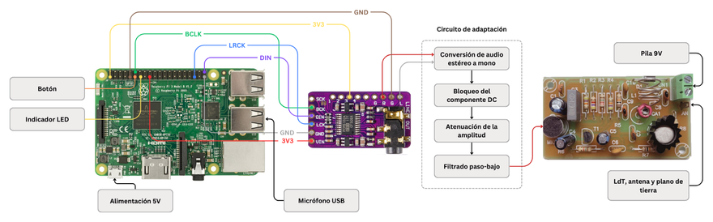
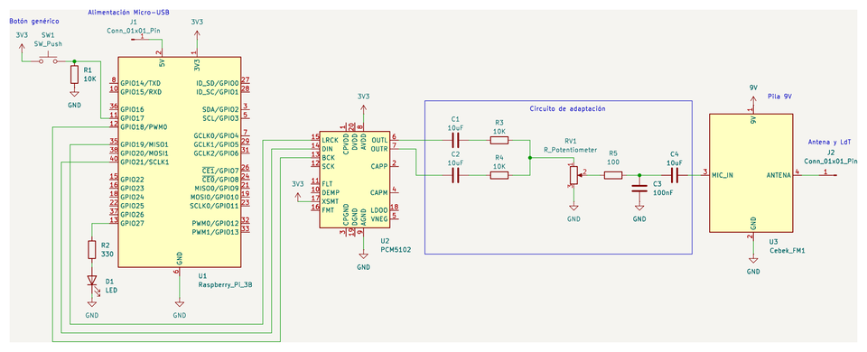
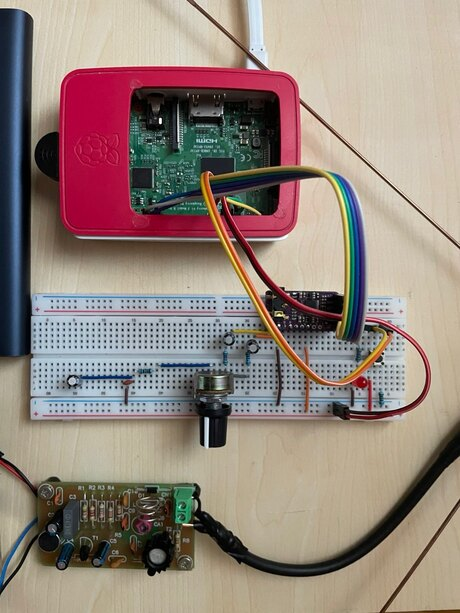
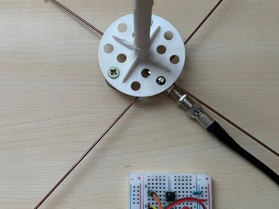
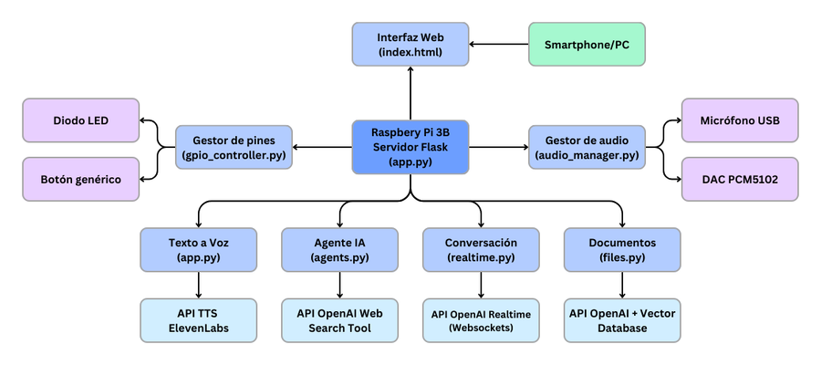

# 📡 AI‑Augmented FM Radio Broadcaster

A classic VHF‑FM radio transmitter, supercharged with modern AI. Type or *speak* a request and a Raspberry Pi turns it into a synthetic‑voice broadcast that any ordinary FM receiver can pick up.

<p>
  
  
  
  
  
  
</p>

<p align="center">
  
</p>

---

## Overview

**STR** bridges two worlds that rarely meet: **analog RF broadcasting** and **large‑language‑model AI**.

At its core is a commercial **VHF‑FM transmitter** whose signal can be received by any standard FM radio. Instead of feeding it a microphone or a music player, STR feeds it **audio generated on demand by AI services** — synthesized speech, live news read in a radio‑presenter voice, real‑time spoken conversation, and answers extracted from uploaded documents.

Everything is orchestrated by a **Raspberry Pi 3B** running a Python **Flask + Socket.IO** server. The Pi generates digital audio, a **PCM5102 DAC** turns it analog, a small custom **signal‑adaptation circuit** conditions it, and the FM module modulates it onto the air. A web interface (usable from any phone or laptop on the same network) and a **physical push‑button + LED** drive the whole thing.

The result is a compact, portable platform where **RF electronics, embedded Linux, real‑time audio DSP, and modern voice AI** all come together.

---

## ✨ Features

STR exposes four AI capabilities, each broadcastable over FM:

| | Feature | What it does | Powered by |
|---|---|---|---|
| 🗣️ | **Text‑to‑Speech** | Type any text and hear it spoken with a natural, expressive voice. | ElevenLabs `eleven_multilingual_v2` |
| 📰 | **AI News Agent** | Ask for today's news, weather, or market data — answered live in a concise radio‑presenter style. | OpenAI Responses API + `web_search` tool (`gpt‑4.1`) |
| 🎙️ | **Real‑time Conversation** | Speak into the USB mic (or press the physical button) and get an instant spoken reply — a live, interactive radio‑host experience. | OpenAI **Realtime API** over WebSockets |
| 📄 | **Document Q&A** | Upload a PDF and ask questions about it, or auto‑generate its key concepts and a quiz. A built‑in didactic assistant. | OpenAI **File Search** + vector store (`gpt‑4.1`) |

All generated audio is played through the DAC, injected into the FM transmitter, and **broadcast on the FM band** in real time.

<p align="center">
  
  <br><sub>The browser UI (Tailwind CSS + Socket.IO): one tab per AI feature, accessible from any device on the local network.</sub>
</p>

---

## 🏗️ System Architecture

The Raspberry Pi is the central node — controller, audio processor, and web server all at once.

<p align="center">
  
</p>

**Signal flow:** `AI services → Raspberry Pi → PCM5102 DAC → adaptation circuit → VHF‑FM transmitter → antenna → 📻 any FM receiver`

---

## 🔊 The Hardware & Signal Chain

The digital audio from the Pi reaches the DAC over the **I²S** protocol (via Linux **ALSA**). The DAC's analog stereo output then passes through a small **adaptation circuit**, designed in **KiCad**, that conditions the signal before it enters the transmitter's microphone input.

<p align="center">
  
</p>

The adaptation circuit performs four jobs:

1. **DC blocking** — series 10 µF capacitors form a high‑pass filter (cutoff ≈ **1.6 Hz**), removing any DC offset so the full audio band passes cleanly.
2. **Stereo → mono mixing** — the L/R channels are summed passively through two 10 kΩ resistors (≈ −6 dB), avoiding active components.
3. **Level control** — a 2 kΩ potentiometer acts as a voltage divider to match the line‑level signal to the transmitter's mic input, preventing saturation.
4. **Low‑pass filtering** — a 100 Ω + 100 nF RC stage (cutoff ≈ **15.9 kHz**) attenuates high‑frequency harmonics and RF interference.

The conditioned audio drives a **CEBEK FM‑1** commercial transmitter module, radiated by a **75 cm copper monopole** over a two‑rod ground plane, fed through 50 Ω coax.

<p align="center">
  
  &nbsp;&nbsp;
  
</p>

A **USB microphone** captures voice at 48 kHz, a **push‑button** (GPIO 17) starts/stops real‑time recording, and a **red LED** (GPIO 27) lights up while recording — so the system can be demoed entirely hands‑off, without a keyboard or mouse.

---

## 🧠 Software Architecture

The codebase is built around **modularity and separation of concerns**: `app.py` wires everything together and serves the web UI, while each capability lives in its own module.

<p align="center">
  
</p>

| Module | Responsibility |
|---|---|
| [`app.py`](app.py) | Flask + Socket.IO server, HTTP/WebSocket routes, service wiring |
| [`tts.py`](tts.py) | Text‑to‑speech via ElevenLabs |
| [`agents.py`](agents.py) | Web‑search news agent (OpenAI Responses API) |
| [`realtime.py`](realtime.py) | Real‑time voice conversation (OpenAI Realtime API / WebSockets) |
| [`files.py`](files.py) | PDF upload, vector indexing & file‑search Q&A |
| [`audio_manager.py`](audio_manager.py) | ALSA/PyAudio capture & playback, format conversion, resampling |
| [`gpio_controller.py`](gpio_controller.py) | Push‑button + LED monitoring (debounced, background thread) |
| [`config.py`](config.py) | Centralized settings & robust audio‑device auto‑detection |
| [`debug.py`](debug.py) | Hardware test endpoints (tone, LED, button, mic) |

**Audio pipeline:** the mic is captured at 48 kHz and resampled to 24 kHz (with `resampy`) for the Realtime API; outgoing audio is converted to 44.1 kHz WAV and played through the PCM5102. `config.py` auto‑detects the correct mic/DAC device indices across machines, so the same code runs on a laptop for development and on the Pi for deployment.

---

## 🧩 Tech Stack

- **Languages:** Python · HTML · JavaScript
- **Backend:** Flask · Flask‑SocketIO · WebSockets
- **Frontend:** Tailwind CSS · Socket.IO
- **AI / APIs:** OpenAI (Realtime, Responses + web search, File Search / vector stores) · ElevenLabs TTS
- **Audio:** ALSA · PyAudio · Pydub · resampy · I²S
- **Hardware:** Raspberry Pi 3B · PCM5102 I²S DAC · CEBEK FM‑1 transmitter · RPi.GPIO
- **Electronics design:** KiCad

---

## 📁 Repository Structure

```
STR/
├── app.py              # Flask + Socket.IO entry point, all routes
├── agents.py           # Web-search news agent
├── realtime.py         # OpenAI Realtime API client (WebSockets)
├── files.py            # PDF upload + vector-store Q&A
├── tts.py              # ElevenLabs text-to-speech
├── audio_manager.py    # Audio capture/playback, conversion, resampling
├── gpio_controller.py  # Physical button + LED handling
├── config.py           # Central config & audio-device detection
├── debug.py            # Hardware diagnostic endpoints
├── setup.py            # One-off: create an OpenAI vector store
├── templates/
│   └── index.html      # Web UI (Tailwind + Socket.IO)
├── utils/              # Standalone hardware test scripts
└── requirements.txt
```

---

## 🚀 Getting Started

### Prerequisites
- A **Raspberry Pi** (tested on a 3B) running Raspberry Pi OS Lite, *or* any Linux/macOS machine for software‑only development.
- Python 3.11+
- API keys for **OpenAI** and **ElevenLabs**.
- *(For the full broadcast setup)* a PCM5102 DAC, the adaptation circuit, and a VHF‑FM transmitter module.

### Installation

```bash
git clone https://github.com/medpar/STR.git
cd STR
python3 -m venv .venv && source .venv/bin/activate
pip install -r requirements.txt
```

> On a Raspberry Pi you'll also want `python3-pyaudio`, `python3-rpi.gpio` and ALSA. On non‑Pi machines the GPIO layer disables itself automatically.

### Configuration

Create a `.env` file in the project root:

```bash
# Required
OPENAI_API_KEY=sk-...
ELEVENLABS_API_KEY=...
VOICE_ID=...            # ElevenLabs voice ID for TTS
MODEL_ID=eleven_multilingual_v2
VECTOR_STORE_ID=...     # see below

# Optional
REALTIME_VOICE_ID=ash   # voice for the Realtime conversation
FLASK_HOST=0.0.0.0
FLASK_PORT=5000
MIC_DEVICE_INDEX=       # override mic auto-detection if needed
DAC_PYAUDIO_INDEX=      # override DAC auto-detection if needed
```

Create the vector store used by the Document Q&A feature and copy its ID into `.env`:

```bash
python setup.py   # prints your VECTOR_STORE_ID
```

### Hardware wiring (Raspberry Pi 3B → PCM5102)

| Raspberry Pi pin | Connects to |
|---|---|
| Pin 1 (3.3 V) | DAC `VIN` |
| Pin 39 (GND) | DAC `GND` |
| Pin 12 (GPIO 18) | DAC `BCLK` (bit clock) |
| Pin 35 (GPIO 19) | DAC `LRCK` (word select) |
| Pin 40 (GPIO 21) | DAC `DATA_IN` |
| Pin 11 (GPIO 17) | Push‑button (10 kΩ pull‑down) |
| Pin 13 (GPIO 27) | Status LED (330 Ω) |

> On the DAC, tie both `SCK` pins together and pull `XSMT` (pin 3) to 3.3 V to enable the jack output. The DAC's `LOUT`/`ROUT` feed the adaptation circuit, whose output goes to the transmitter's `MIC_IN`.

### Running

```bash
python app.py
```

Then open `http://<raspberry-pi-ip>:5000` from any device on the same network and start broadcasting. Tune a nearby FM radio to the transmitter's frequency to hear it on the air. 🎶

---

## ⚠️ Notes & Limitations

- The project relies on **cloud AI APIs**, so an internet connection (and per‑token cost) is required at runtime.
- Output power is intentionally low — the signal is meant to cover a room/lab. Always **respect local regulations** on radio transmission and only transmit within legally permitted bands and power limits.
- The adaptation circuit values were tuned empirically across several iterations to balance audio fidelity against transmitter compatibility.

## 🗺️ Roadmap

- Digitally controlled transmit frequency from the web dashboard
- An **offline mode** using self‑hosted local LLMs
- Automated content scheduling & playlists
- A real‑time spectrum / system‑status monitoring dashboard
- A 3D‑printed enclosure unifying all components
